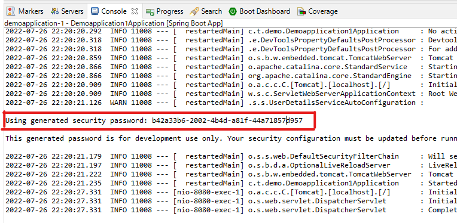
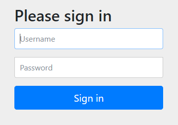
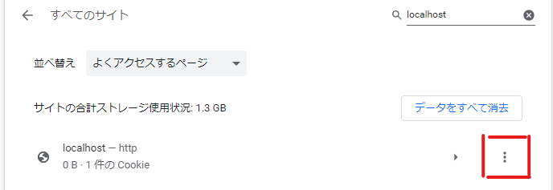

# 毎日のSpring Boot

毎日、このシステムを作成して画面を持つWebアプリケーションの作成になれておく。

その手順を以下に示す。

事前に前段階のlevelファイル内容を理解・構築してある前提です。

## Spring Security 導入

Basic 認証をかけることができます。

```
Basic認証・・・ユーザ名とパスワードの組みをコロン ":" でつなぎ、Base64でエンコードして送信する。
このため、盗聴や改竄が簡単であるという欠点を持つが、ほぼ全てのWebサーバおよびブラウザで対応しているため、広く使われている。
```

引用 [Wikipedia-Basic認証](https://ja.wikipedia.org/wiki/Basic%E8%AA%8D%E8%A8%BC)

## pom.xmlの修正


以下を導入するためpom.xmlを修正する

- spring-boot-starter-security
- thymeleaf-extras-springsecurity5
- spring-boot-devtools
- spring-security-test

```xml
<?xml version="1.0" encoding="UTF-8"?>
<project xmlns="http://maven.apache.org/POM/4.0.0" xmlns:xsi="http://www.w3.org/2001/XMLSchema-instance"
	xsi:schemaLocation="http://maven.apache.org/POM/4.0.0 https://maven.apache.org/xsd/maven-4.0.0.xsd">
	<modelVersion>4.0.0</modelVersion>
	<parent>
		<groupId>org.springframework.boot</groupId>
		<artifactId>spring-boot-starter-parent</artifactId>
		<version>2.7.2</version>
		<relativePath/> <!-- lookup parent from repository -->
	</parent>
	<groupId>com.tonaise</groupId>
	<artifactId>demoapplication</artifactId>
	<version>0.0.1-SNAPSHOT</version>
	<name>demoapplication</name>
	<description>Demo project for Spring Boot</description>
	<properties>
		<java.version>17</java.version>
	</properties>
	<dependencies>
		<dependency>
			<groupId>org.springframework.boot</groupId>
			<artifactId>spring-boot-starter-security</artifactId>
		</dependency>
		<dependency>
			<groupId>org.springframework.boot</groupId>
			<artifactId>spring-boot-starter-thymeleaf</artifactId>
		</dependency>
		<dependency>
			<groupId>org.springframework.boot</groupId>
			<artifactId>spring-boot-starter-web</artifactId>
		</dependency>
		<dependency>
			<groupId>org.thymeleaf.extras</groupId>
			<artifactId>thymeleaf-extras-springsecurity5</artifactId>
		</dependency>

		<dependency>
			<groupId>org.springframework.boot</groupId>
			<artifactId>spring-boot-devtools</artifactId>
			<scope>runtime</scope>
			<optional>true</optional>
		</dependency>
		<dependency>
			<groupId>org.springframework.boot</groupId>
			<artifactId>spring-boot-starter-test</artifactId>
			<scope>test</scope>
		</dependency>
		<dependency>
			<groupId>org.springframework.security</groupId>
			<artifactId>spring-security-test</artifactId>
			<scope>test</scope>
		</dependency>
	</dependencies>

	<build>
		<plugins>
			<plugin>
				<groupId>org.springframework.boot</groupId>
				<artifactId>spring-boot-maven-plugin</artifactId>
			</plugin>
		</plugins>
	</build>

</project>
```

### ディレクトリ作成

src\main\webapp\WEB-INF

### Spring Security実施のためのファイル配置

src\main\webapp\ 配下へ以下1fileを作成

- index.jsp
```jsp
<%@taglib prefix="c" uri="http://java.sun.com/jsp/jstl/core" %>
<%@page contentType="text/html" pageEncoding="UTF-8"%>
<!doctype html>
<html>
    <head>
        <meta charset="utf-8" />
        <title>Hello Spring Security!!</title>
    </head>
    <body>
        <h1>Hello Spring Security!!</h1>
        
        <c:url var="logoutUrl" value="/logout" />
        <form action="${logoutUrl}" method="post">
            <input type="submit" value="logout" />
            <input type="hidden" name="${_csrf.parameterName}" value="${_csrf.token}" />
        </form>
    </body>
</html>
```

src\main\webapp\WEB-INF 配下へ以下2fileを作成

- applicationContext.xml

```xml
<?xml version="1.0" encoding="UTF-8"?>
<beans xmlns="http://www.springframework.org/schema/beans"
       xmlns:sec="http://www.springframework.org/schema/security"
       xmlns:xsi="http://www.w3.org/2001/XMLSchema-instance"
       xsi:schemaLocation="
         http://www.springframework.org/schema/beans
         http://www.springframework.org/schema/beans/spring-beans-3.0.xsd
         http://www.springframework.org/schema/security
         http://www.springframework.org/schema/security/spring-security.xsd">

    <sec:http>
        <sec:intercept-url pattern="/login" access="permitAll" />
        <sec:intercept-url pattern="/**" access="isAuthenticated()" />
        <sec:form-login />
        <sec:logout />
    </sec:http>

    <sec:authentication-manager>
        <sec:authentication-provider>
            <sec:user-service>
                <sec:user name="hoge" password="HOGE" authorities="ROLE_USER" />
            </sec:user-service>
        </sec:authentication-provider>
    </sec:authentication-manager>
</beans>
```

- web.xml

```xml
<?xml version="1.0" encoding="UTF-8"?>
<web-app xmlns="http://xmlns.jcp.org/xml/ns/javaee"
	xmlns:xsi="http://www.w3.org/2001/XMLSchema-instance"
	xsi:schemaLocation="http://xmlns.jcp.org/xml/ns/javaee 
         http://xmlns.jcp.org/xml/ns/javaee/web-app_3_1.xsd"
	version="3.1">
	<filter>
		<filter-name>springSecurityFilterChain</filter-name>
		<filter-class>org.springframework.web.filter.DelegatingFilterProxy</filter-class>
	</filter>

	<filter-mapping>
		<filter-name>springSecurityFilterChain</filter-name>
		<url-pattern>/*</url-pattern>
	</filter-mapping>

	<listener>
		<listener-class>org.springframework.web.context.ContextLoaderListener</listener-class>
	</listener>
</web-app>
```

## Spring Boot Appとして実行する

起動時にコンソールにBasic認証時のパスワードが表示されるためコピーしておく。

パスワードは起動ごとに変わる。



## Browserで確認

http://localhost:8080/greeting



Username：user
Password：（コピーしておいたコンソールの値）

Basic認証後は Hello World! が表示されることを確認する。

Basic認証を解除（ログアウト）する場合は

http://localhost:8080/logout

もしくはブラウザの設定からlocalhostのデータを削除する。

ブラウザ事に異なるが、例えばChrome（バージョン: 103.0.5060.134（Official Build） （64 ビット））では以下である。

```
サイトの設定 > すべてのサイトに保存されている権限とデータを表示
からlocalhostの設定を削除する。
```

