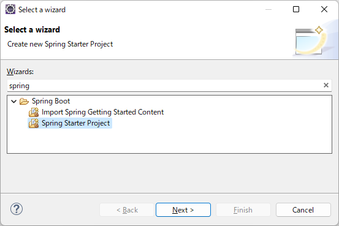
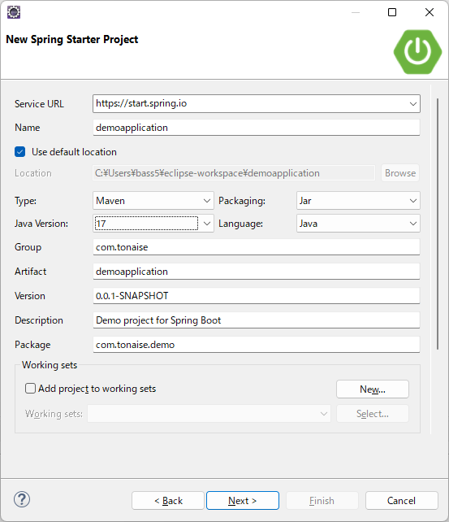
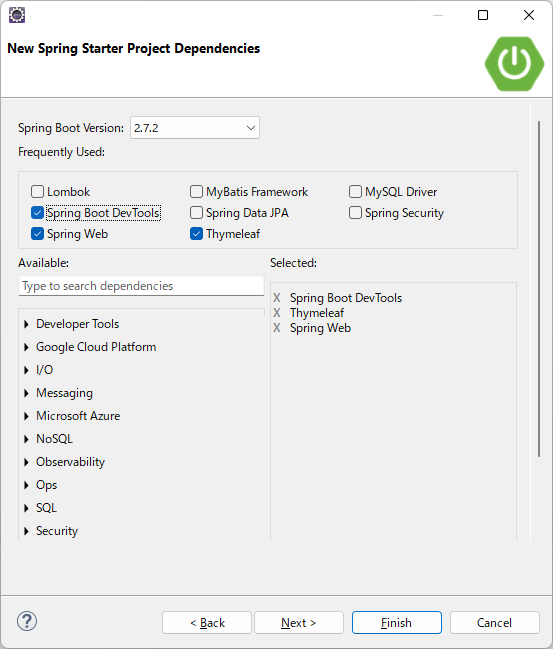
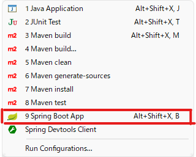

# 毎日のSpring Boot

毎日、このシステムを作成して画面を持つWebアプリケーションの作成になれておく。

その手順を以下に示す。

## Spring Initializer を使用した雛形作成

以下サイトからも雛形を作成・ダウンロードできる。

https://start.spring.io/

ここではeclipseの新規プロジェクト作成ウィザードから作成する方法を示す。

- Spring Starter Projectを選択しNext



- 以下のように入力しNext



```
Name：demoapplication
Group：com.tonaise
Artifact：demoapplication
Package：com.tonaise.demo
```

- 以下を選択しFinish



## Web コントローラーを作成する

- 以下のパッケージをsrc/main/java配下に作成する

com.tonaise.demo.controller

- 以下のクラスを作成する

```java
package com.tonaise.demo.controller;

import org.springframework.stereotype.Controller;
import org.springframework.ui.Model;
import org.springframework.web.bind.annotation.GetMapping;
import org.springframework.web.bind.annotation.RequestParam;

@Controller
public class GreetingController {

    @GetMapping("/greeting")
    public String greeting(@RequestParam(name = "name", required = false, defaultValue = "World") String name,
	    Model model) {
	model.addAttribute("name", name);
	return "greeting";
    }

}
```

## Thymeleafテンプレートファイルを作成する

src/main/resources/templates/greeting.html を作成する。

```html
<!DOCTYPE html>
<html>
<head>
<meta charset="UTF-8">
<title>Demo App Greeting Page</title>
</head>
<body>

</body>
</html>
```

## Spring Boot Appとして実行する



## Browserで確認

http://localhost:8080/greeting

にアクセスし `Hello, World!` が表示されることを確認する。

http://localhost:8080/greeting?name=User

にアクセスしクエリパラメータにより `Hello, User!` が表示されることを確認する。

画面を持つWebアプリケーションのサンプル作成完了。
